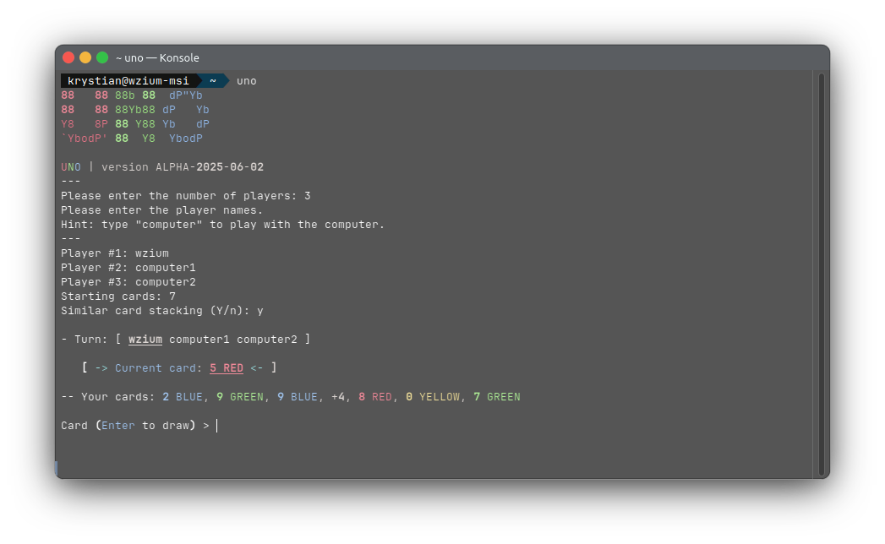

# 🎴 UNO
A simple Python implementation of the UNO game.

### ⚠️ WARNING: WORK IN PROGRESS.
It's best to look at the `#TODO` notes inside files.



To-do features:
[TODO.md](TODO.md)

#### CLI switches
- `--debug` or `-D` - always shows the opponents' cards
- `--cheats` or `-C` - enables the cheat console; example:
```
Turn: test
Your cards: [7 RED, +2 YELLOW, SKIP BLUE]
Current card: 5 RED
Card (Enter to draw): #game.opponent.hand = [Card.from_str('+4') for _ in range(666)]
```
All cheat codes must be preceded with `#`.

## API Preview
These are just **examples**.
- Inspecting a card
```python
card = Card(CardType.CARD_6, CardColor.BLUE)
other_card = Card.from_str('7 RED')
if card.playable(other_card):
    print("This card is playable with the other card.")
```

- Generating a deck
```python
deck = Deck(size=50)
cards: list[Card] = deck.draw(15)
```

- Inspecting a player
```python
player = Player('wzium')
if player.is_computer:
    print("The player is a computer.")
if len(player.hand) == 0:
    print("The player does not have any card.")
```

- Working with the table
```python
players: list[Player] = [Player('Wzium'), Player('Computer')]
# Custom rules (W.I.P.)
rules: dict[str, Any] = {'starting_cards': 7,
                         'cheats': False,
                         'card_stacking': True}

table = Table(players, rules)
table.play(table.turn.hand[0], table.turn) # Gets the user to play the first card 
print(table.last_played_card) # Get the last player card
table.deal_card(table.next_turn, 5) # Gives 5 cards to the player in next turn
```

- Operating with the game
```python
game = Game(players, rules)
while game.active:
    if game.get_winner() is not None:
        game.win(game.get_winner())
```

- Handling a turn
```python
turn = Turn(table)
print(turn.playable_cards) # gets all currently playable cards
print(turn.most_reasonable_color) # selects the appriopriate color based on how many times it appears
print(turn.get_result()) # Prints a card to play with
```